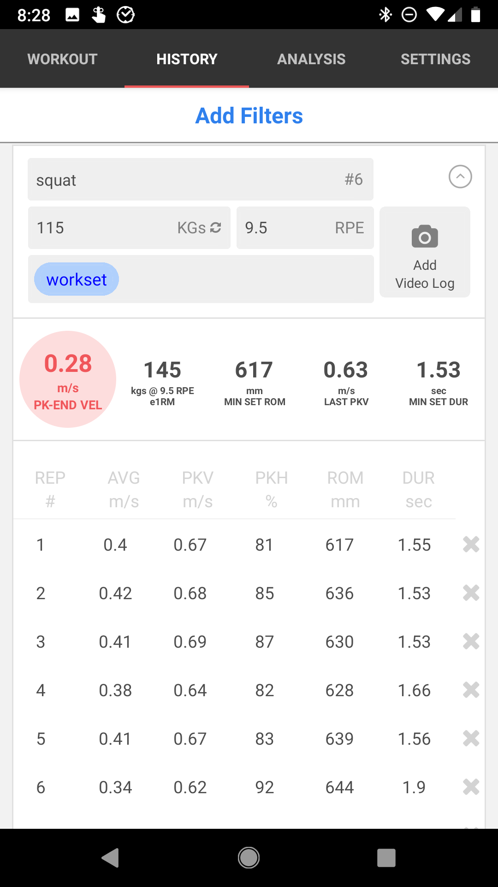
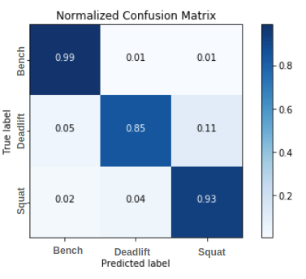
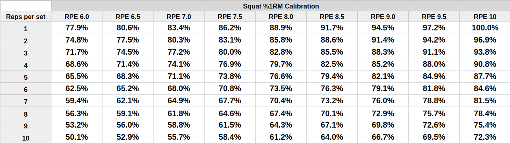
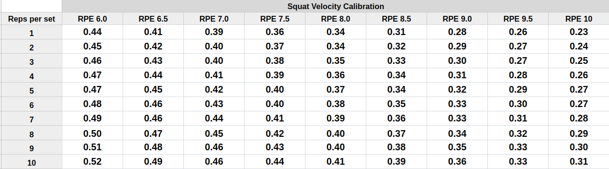
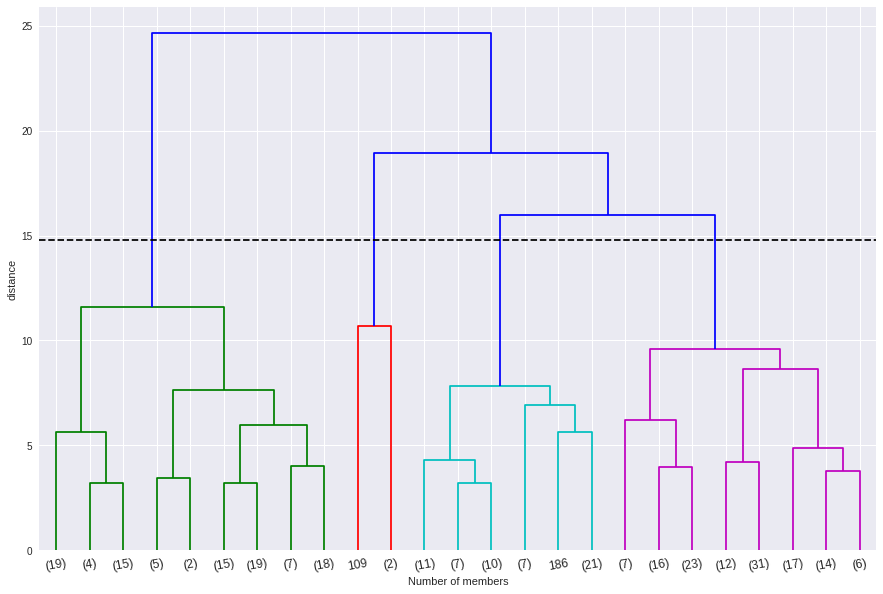
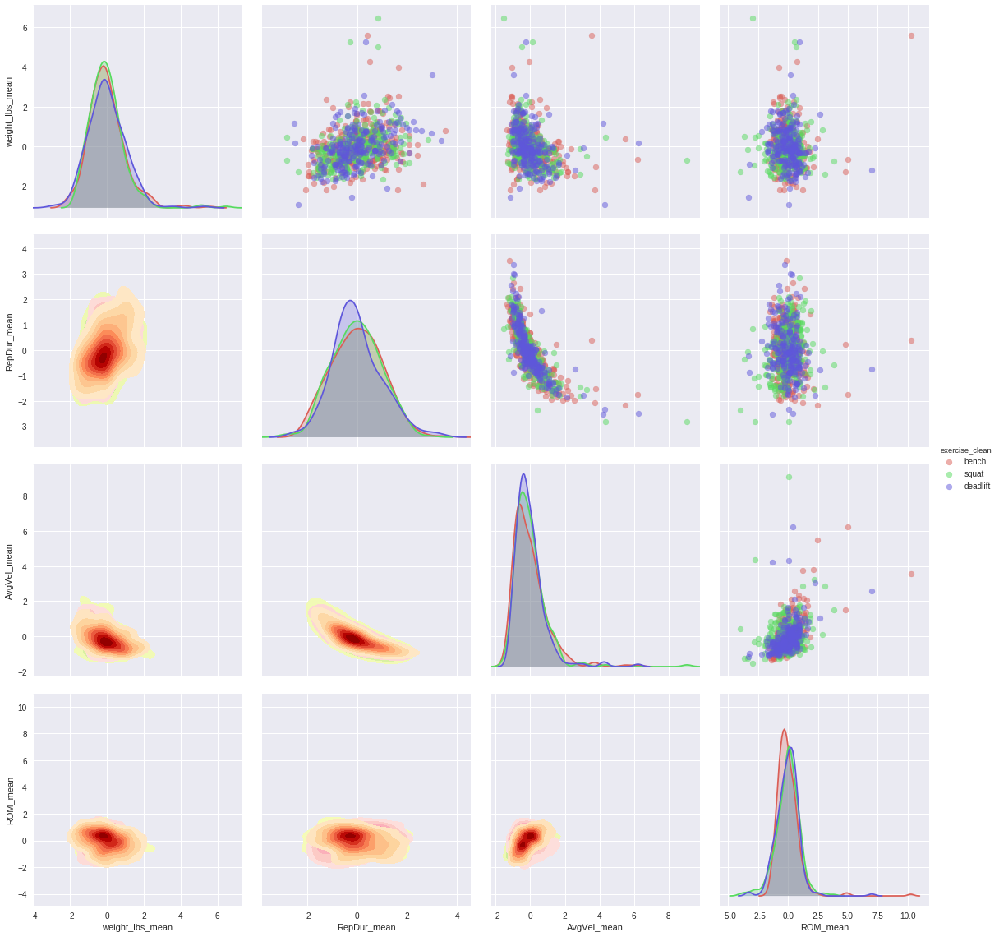
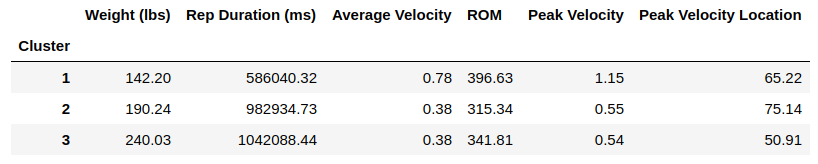

```{r setup, include=FALSE, warning=FALSE, message=FALSE}
knitr::opts_chunk$set(echo = FALSE)
options(knitr.table.format = "latex")
```

```{r}
suppressMessages(library(knitr))
suppressMessages(library(kableExtra))
```

### Table of Contents

- [Introduction](#introduction)
- [What Is a Velocity Transducer?](#what-is-a-velocity-transducer)
- [What Do We Want to Achieve?](#what-do-we-want-to-achieve)
- [Exercise Classification](#exercise-classification)
- [Lifter Clustering](#lifter-clustering)
- [Conclusions](#conclusions)

### Introduction

Data is the belle of the ball these days, and it's time to apply data science in the weight room. This could mean anything from getting a more accurate 1RM estimate to preventing injury. 

Data science has many faces. Randomized controlled trials, the [\textcolor{blue}{only reliable method}](https://www.bmj.com/content/316/7126/201) to prove cause-effect relationship, have been employed by sports scientists for many years, but the studies tend to be limited to a small group of participants, usually young male. On the other hand, machine learning algorithms are great at detecting patterns, making predictions, and classifying information. With the right dataset and a focus on individual differences, we can start isolating the hundreds, or even thousands of training variables that lead to program variation. 

This paper is a demonstration of how we are using data collected from our network of training devices to improve your experience in the weight room. First, we will demonstrate how metrics captured in the background can detect performed exercise with 96% accuracy. Why does it matter? User inputs are infamously unreliable, unfortunately, but a lot of our analytics reports depend on accurate exercise specification. In the second section, we will share some of our early efforts to perform lifter clustering. This is a hard problem to solve, but it has large implications for building effective and cost-efficient custom training programs.

#### Acknowledgments

This white paper is the result of a project developed by data science students at UC Berkeley: [\textcolor{blue}{Renzee Reyes}](https://www.ischool.berkeley.edu/people/renzee-reyes), [\textcolor{blue}{Tim Witthoefft}](https://www.ischool.berkeley.edu/people/tim-witthoefft), [\textcolor{blue}{Jack Workman}](https://www.ischool.berkeley.edu/people/jack-workman) and [\textcolor{blue}{Yulia Zamriy}](https://www.ischool.berkeley.edu/people/yulia-zamriy). 

### What Is a Velocity Transducer?

If you're reading this white paper, you're most likely familiar with velocity transducers like OpenBarbell, but a quick refresher can only help with what we are going to cover in this paper:

>*OpenBarbell is a device with a retractable string that attaches to your workout equipment to deliver data such as speed or range of motion.*^[OpenBarbell is no longer in production. S&S is working on [\textcolor{blue}{RepOne}](https://www.reponestrength.com/), full weight room analytics platform.]

The key word in the statement above is *data*. Traditionally these devices have been used to do rudimentary tasks, like velocity thresholds and dynamic effort sessions, but as the science develops we’re finding significantly more powerful uses for the type of information you can collect with these devices. 

### What Do We Want to Achieve?

For the purposes of this analysis we will focus on the *big three*: `squat`, `bench press` and `deadlift` (including sumo) performed with a bar. A velocity transducer is usually attached by a string to the bar, with the data recorded during the concentric part of the movement. When using OpenBarbell, the app will show a quick snapshot of the data immediately after each rep:

{width="100" height="200"}


In general, there are three types of data for each set:

| Rep-specific | Set aggregates | User inputs |
|---|---|---|
| Rep number | Peak-end velocty^[The mean of the slowest and last repetitions (average velocity) of a set] | Exercise name |
| Average velocity | Estimated 1RM | Weight |
| Peak velocity | Minimum range of motion | Metric (kgs/lbs) |
| Peak velocity height | Last rep peak velocity | RPE |
| Randge of motion | Minimum set duration | Tags |
| Duration |  | Video Log |
| [\textcolor{blue}{Other}](https://github.com/squatsandsciencelabs/OpenBarbell-V3/wiki/OpenBarbell-Data-Storage-Format) | |  |

The app does not have any restrictions on the inputs in the text fields (i.e., exercise and tags), and lifters can get very creative with their naming conventions. However, if we wanted to analyze the squat, we would need to sift through all the records and extract the correct ones, which is time-consuming and prone to error. Moreover, what if a user did not impute any exercise name, but it was still a valid set? It's a valuable data point that cannot be used without an exercise label. 


A supervised classification algorithm can help us solve the above stated problems, and if it's good enough (we'll cover that in the next section), it can eliminate the need for user input in general. AI in action! But not really (forgive us for our eagerness to be on top of the trend to call everything data-related AI). 

Hence, the first part of the analysis is all about exercise classification:

>*Can we use machine learning to accurately classify exercise type based on measurements taken by the OpenBarbell device?*

The second question is more complex and does not have one correct answer:

>*Is there an inherent grouping of lifters based on their lifting parameters (i.e., velocity, range of motion, etc.) that could be leveraged to introduce automation and individualize their training?*

There are fast lifters and there are grinders. There are people who fail deadlifts off the floor, and there are those who struggle with a lockout. Yet programs prescribing everyone the same percent of 1RM for the same number of sets/reps are still common because everybody is different, and it's almost impossible to scale customized percentages on a case by case basis. Maybe big data can change that.

###  Exercise Classification

#### Algorithm

As mentioned above, we used [\textcolor{blue}{supervised learning}](https://en.wikipedia.org/wiki/Supervised_learning) to solve our first problem. The dataset contained a subset of the OpenBarbell database that had sets with clearly labeled exercises. Clear labels for squats, bench press and deadlift were used as a source of truth in detecting patterns distinguishing the big three lifts. The model was trained on 80% of the data^[Our full analysis dataset for exercise classification consisted of around 180,000 repetitions], while the remaining 20% were used to validate it. The accuracy of the model was determined by whether the patterns detected on the 80% were distinct enough to correctly classify exercises on the subset of data that the model has not seen before.

There are a lot of supervised classification algorithms out there. We tested four classic ones: [\textcolor{blue}{KNN}](https://en.wikipedia.org/wiki/K-nearest_neighbors_algorithm), [\textcolor{blue}{Random Forest}](https://en.wikipedia.org/wiki/Random_forest), [\textcolor{blue}{Logistic Regression}](https://en.wikipedia.org/wiki/Logistic_regression), and [\textcolor{blue}{Naive Bayes}](https://en.wikipedia.org/wiki/Naive_Bayes_classifier). The first two were distinct winners (their accuracies were almost identical), and the final choice of the algorithm will depend on the implementation. 

#### Results

How well did the model work? 96% of the sets in the data put aside for validation were correctly classified by exercise^[At the first stage of the analysis, exercise prediction was done for each rep. But the final prediction was established on a set level by selecting the most common exercise assignment among reps in a set]. However, there are some interesting details to discover about each of three exercises on a more granular rep level. 

For example, as illustrated by the matrix below, bench press is the easiest to detect (99% of all bench press exercises were correctly identified). On the other hand, the model had some trouble distinguishing deadlifts from squat: only 85% of deadlifts were correctly identified, and 11% of actual deadlifts were classified as squats. We can speculate about why this happens (similar range of motion, for example), but instead we'll just say that there is some room for improvement and more interesting insights to look for, and count this as another reason why 3D position sensing is a highly anticipated upcoming feature in these types of products.

{width="250" height="150"}

And what were the most important features (a.k.a measurements) that differentiated the three lifts? `Range of motion` was by far the most significant one. `Peak Velocity Location`, `Peak Velocity` and `Lifted Weight` were also on the top 5 list (the distant fifth was `Rep Duration`).

There are different ways of using these results. The most obvious and immediate benefit is cleaner data for analysis (and more interesting reports for you as a result). Moreover, we could take this analysis further and start looking at how distinguishable the exercises are by lifter, which brings us to the next topic.

### Lifter Clustering

#### Framework

For this part of the analysis we aggregated the data to the user level. As a result our dataset consisted of 250-300 records depending on the exercise. This was more than sufficient to start investigating which captured measurements differentiate athletes. 

Why would this analysis matter to you? Have you ever used a program that was based on an athlete's one repetition maximum (1RM)? For example, you would use a table similar to the one below to calculate what weight to use for the set of 5 at RPE 8.0 (It is based on the observational study we conducted at S&S Barbell. More details [\textcolor{blue}{here}](https://blog.squatsandscience.com/building-context-with-vbt-a-white-paper-by-the-repone-strength-team-172582be8b73)).

{width="500" height="175"}

Or if you have a velocity measurement device, you may have used peak-end velocity to inform your training^[We recently wrote how to customize these tables based on your historical metrics. You can check out [\textcolor{blue}{this blog post}](https://blog.squatsandscience.com/calibrate-your-strength-6a7d9d83f993)]:

{width="500" height="175"}

Both methods have been developed for an *average* lifter. Unfortunately, this *average* can mean a lot of different things and is defined by a group of people used in developing the above tables. 

What if we could analyze all the lifters in our database, determine *natural* groupings based on their performance metrics and create multiple versions of the tables above for each distinct lifter profile? Then we would provide you with a small set of rules to detect your profile membership and pick the right calibration table for you. That's only one of the possible applications of lifter profiles. We are also working on using them to improve our exercise classification, [\textcolor{blue}{1RM calculation}](https://en.wikipedia.org/wiki/One-repetition_maximum), automated training guidance, and more, because there is no "one formula" that fits all. 

#### Algorithm 

This analysis can be described as exploratory because our goal was to discover natural groupings of lifters based on various performance metrics. At the beginning, we didn't even know how many different profiles there should be. To start things off we created a dataset split by exercise and aggregated it to the OpenBarbell user level (and stripped all the data that was not relevant to lift performance). The idea of splitting data by exercise was driven by the assumption that the same lifter can belong to different groups in all three exercises.

The next step was to apply [\textcolor{blue}{hierarchical clustering}](https://en.wikipedia.org/wiki/Hierarchical_clustering) to determine how many distinct clusters we can identify in the data. This part is as much an art as a science because the results are dependent on a wide range of factors (selected features, distance metric, linkage function etc.). Hence, it's important to set clear goals for the analysis from the get-go. Another key to a good set of clusters is being able to interpret what makes these groups of lifters distinct. The solution can't be a black box.

The outcome of hierarchical clustering is captured by a [\textcolor{blue}{dendrogram}](https://en.wikipedia.org/wiki/Dendrogram) (see below). It has three key elements:

1. Three colors (green, red and cyan) identify potential clusters of lifters (the number is an arbitrary choice based on visual inspection of the chart)
2. Vertical lines represent individual lifters. The chart has been truncated at the bottom for simplification (the numbers along the X-axis represent how many individuals were grouped together to create that line)
3. The length of the vertical lines amounts to the magnitude of differences between groups of lifters

{width="300" height="150"}


#### Results

For simplicity let's focus on bench press only. Our current solution is a work in progress, but we want to show you the power of data analysis and its potential in the weight room.

Our first workable solution for bench press consists of three clusters of lifters with 57, 116 and 117 members in each (they are captured by the chart above). Four metrics were used to form these clusters: `Peak Velocity`, `Peak Velocity Location`, `Rep Duration` and `Lifted Weight`. 

Since there are four metrics included in the solution, it's hard to visualize selected clusters with more than two metrics at a time (3D plots are cool, but even harder to read). The chart below is not easy to interpret at first glance either. It consists of three parts:

1. 4 diagonal plots: density distributions of the above stated metrics by cluster (color). The further apart the three (almost) bell-shaped curves are, the more difference exists among clusters
2. 6 upper corner plots (above diagonal): bivariate scatterplots. Each dot represents one lifter colored by cluster membership
3. 6 lower corner plots (lower diagonal): bivariate density distributions. Each blob is a separate cluster with the darkest area representing metric mean, while contours represent metric variance

The more you stare at it, the more insights you can extract. For example, the one metric where all three clusters look distinctly separated appears to be `Peak Velocity Location` (plot in row 3, column 3). That means that people differ significantly at a point where they reach peak velocity on bench press. However, `lifted weight` (plot in row 1, column 1) can also tell us a lot about these clusters. The red cluster has a heavier tail on the left, which means that it captures athletes that have lighter bench. Heavy benchers, on the other hand, are grouped into the purple cluster with a long tail.

{width="500" height="400"}

A simpler way to look at the clusters is to compare averages of the selected metrics (see table below). It's a small set of numbers, but there is a lot of insight to derive from it. For example, *cluster 1* has the widest `Range of Motion`, highest `Velocities` and lightest `Lifted Weight`. Would that mean that this cluster captures relatively new to lifting athletes? We'll leave this question for you to contemplate.

{width="500" height="100"}

This solution is not final. We might want to split up those clusters even further, or try including more metrics for higher precision. As mentioned previously, one of our goals for these clusters is to develop 1RM calculation that is more customizable to various types of lifters. If we do succeed, it will be exciting for us as it proves the power of data, and for you because it means better programming.

#### Conclusions

If you got to this section, it means you found something interesting in this paper. We don't know if it's because you like data analysis or because you want to know how to apply this in your weight room. In either case, we hope you found something useful and you'll stay tuned for similar reports. In the meantime, we'll keep crunching the numbers to answer ever more complex and interesting questions.

If you have any comments or questions, please reach out! We'll be more than happy to discuss our approach, take suggestions for improvement and answer any questions.
